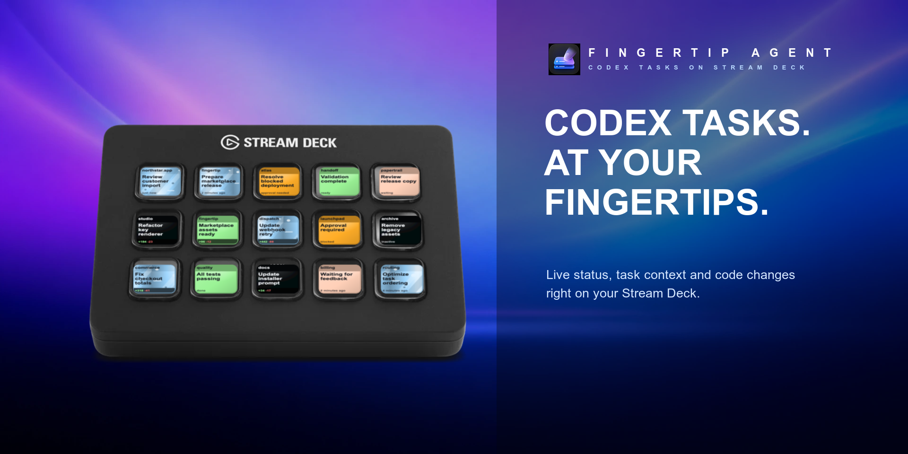
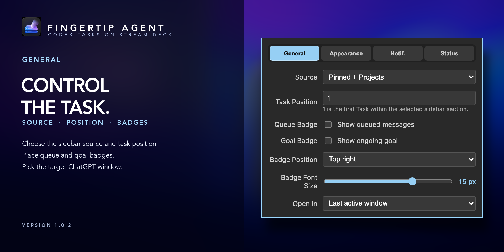
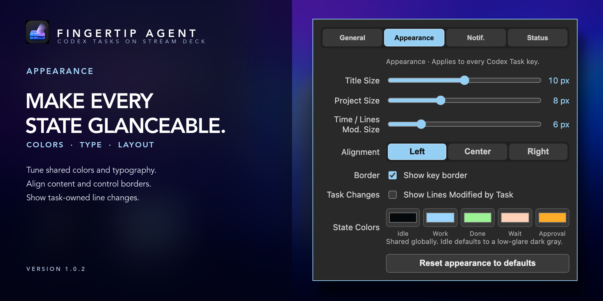
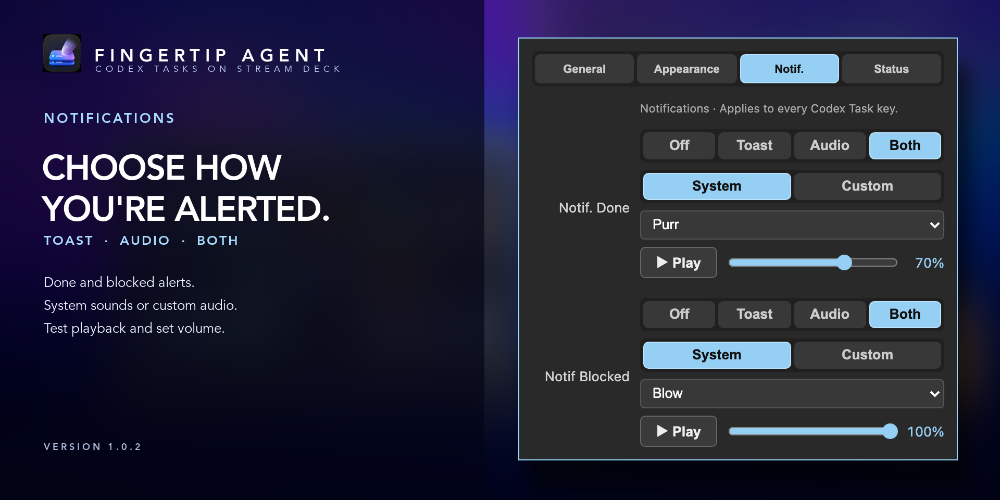

# Fingertip Agent

Fingertip Agent brings local ChatGPT Codex tasks to Stream Deck. Follow live
task status at a glance, preserve the familiar ChatGPT sidebar order, and jump
straight to the exact task you need with one key press.

[](https://marketplace.elgato.com/product/fingertip-agent-eb6fc4f2-5c44-4d98-a825-4e7bb97d1ccd)

## Features

- Live keys for Idle, Working, Done, Waiting, and Approval Required states.
- Animated working and transition feedback, with configurable shared state
  colors, typography, alignment, and borders.
- Separate `Pinned + Projects` and `Tasks` sources that follow ChatGPT's
  sidebar order.
- One-key navigation to the exact matching Codex task, with a choice of the
  last-active, leftmost, or rightmost ChatGPT window.
- Optional task-owned line-change statistics plus queue and ongoing-goal
  badges with configurable placement and size.
- Shared settings organized into General, Appearance, Notifications, and
  Status tabs.
- Independent notifications when a task enters Done or Approval Required:
  `Off`, `Toast`, `Audio`, or `Both`.
- macOS system-sound presets or a custom audio file for each transition, with
  a test-play button and independent volume controls.







Native Toast notifications follow the notification style configured in macOS:
Temporary notifications disappear automatically, while Persistent
notifications remain until dismissed. Audio files are copied locally; accepted
formats are AAC, AIFF, AU, CAF, M4A, MP3, MP4, and WAV up to 25 MB.

## Requirements

- macOS 13 or newer
- Stream Deck 7.1 or newer
- ChatGPT for macOS
- Node.js 24 for development or manual installation

## Install

[Get Fingertip Agent from the Elgato Marketplace](https://marketplace.elgato.com/product/fingertip-agent-eb6fc4f2-5c44-4d98-a825-4e7bb97d1ccd),
or give your coding agent this prompt from the repository directory:

> Install Fingertip Agent on this Mac. First verify the requirements above. Then run
> `npm ci`, `npm run check`, and `npm run build`. Validate
> `com.lukas-bhm.fingertip.sdPlugin` with the Stream Deck CLI, link that plugin
> directory into Stream Deck, and restart the plugin. Do not modify the source.
> Tell me about any failed check or macOS permission prompt.

## Settings

Add or select a Codex Task key in Stream Deck:

- **General** selects the sidebar source, one-based task position, badges, and
  target ChatGPT window.
- **Appearance** controls shared key colors, fonts, alignment, borders, and
  line-change statistics.
- **Notif.** configures Done and Approval Required notifications independently.
  Audio and Both modes expose the sound source, system preset or custom-file
  picker, test-play control, and volume.
- **Status** shows the current key preview, connection diagnostics, component
  versions, and a manual reconnect action.

Appearance and notification preferences are global and apply to every Codex
Task key. Source and task position remain specific to each key.

## Development

```sh
npm ci
npm run check
npm run build
npx streamdeck validate com.lukas-bhm.fingertip.sdPlugin
npx streamdeck pack com.lukas-bhm.fingertip.sdPlugin --output dist
```

Use `npm run reload` to build and restart the linked plugin during local
development.

## Version 1.0.2

- Added tabbed settings for a roomier Property Inspector.
- Added independent Done and Approval Required notifications.
- Added Toast, Audio, and combined Both notification modes.
- Added macOS system sounds, custom audio import, test playback, and volume.
- Added shared appearance controls, task change statistics, and queue/goal
  badges.

## Compatibility and privacy

Task metadata, appearance settings, and custom audio stay on the Mac.
Fingertip Agent uses ChatGPT's private, unsupported desktop IPC protocol. A future
ChatGPT update may require a compatibility update.

## License

[MIT](LICENSE)
