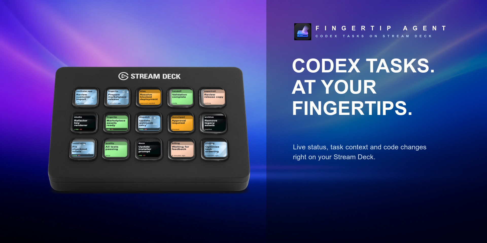
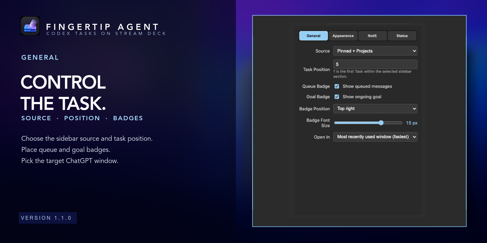
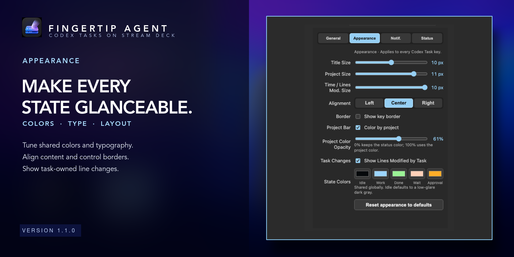
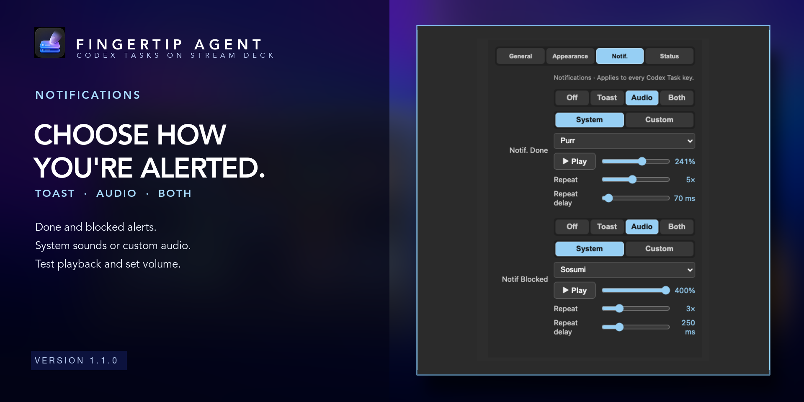
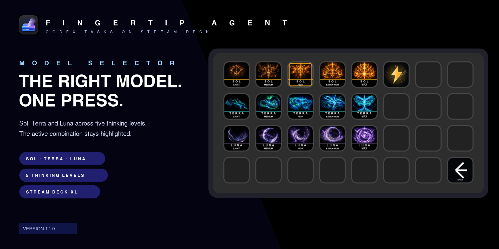

# Fingertip Agent

Fingertip Agent brings local ChatGPT Codex tasks to Stream Deck. Follow live
task status at a glance, preserve the familiar ChatGPT sidebar order, and jump
straight to the exact task you need with one key press.

[](https://marketplace.elgato.com/product/fingertip-agent-eb6fc4f2-5c44-4d98-a825-4e7bb97d1ccd)

## Features

- Live keys for Idle, Working, Done, Waiting, and Approval Required states.
- Animated working and transition feedback, with configurable shared state
  colors, typography, alignment, and borders.
- Project-colored title bars with deterministic shades per project, adjustable
  opacity for blending with the current status color, and automatic
  contrast-aware black or white text.
- Project bars scale with the project-name font and keep the title vertically
  centered with balanced padding.
- Separate `Pinned + Projects` and `Tasks` sources that follow ChatGPT's
  sidebar order.
- One-key navigation to the exact matching Codex task, with a choice of the
  last-active, leftmost, or rightmost ChatGPT window. Active tasks can open a
  fresh ChatGPT conversation when needed.
- A Model Selector key opens a bundled Stream Deck XL profile with a 4-by-5
  Astra 6, Sol, Terra, and Luna matrix for Light, Medium, High, Extra High, and Max thinking.
  The selected combination is highlighted and applied to the active Composer;
  a live Fast Mode key toggles that Composer's service tier in place.
- Single press opens a task, double press highlights it, and long press marks
  it unread.
- Optional task-owned line-change statistics plus queue and ongoing-goal
  badges with configurable placement and size.
- Shared settings organized into General, Appearance, Notifications, and
  Status tabs.
- Independent notifications when a task enters Done or Approval Required:
  `Off`, `Toast`, `Audio`, or `Both`.
- macOS system-sound presets or a custom audio file for each transition, with
  a test-play button, independent volume controls, repeat counts, and repeat
  delays.









Native Toast notifications follow the notification style configured in macOS:
Temporary notifications disappear automatically, while Persistent
notifications remain until dismissed. Audio files are copied locally; accepted
formats are AAC, AIFF, AU, CAF, M4A, MP3, MP4, and WAV up to 25 MB.

## Requirements

- macOS 13 or newer
- Stream Deck 7.1 or newer
- ChatGPT for macOS
- Node.js 24 for development or manual installation

## Install

[Get Fingertip Agent from the Elgato Marketplace](https://marketplace.elgato.com/product/fingertip-agent-eb6fc4f2-5c44-4d98-a825-4e7bb97d1ccd),
or give your coding agent this prompt from the repository directory:

> Install Fingertip Agent on this Mac. First verify the requirements above. Then run
> `npm ci`, `npm run check`, and `npm run build`. Validate
> `com.lukas-bhm.fingertip.sdPlugin` with the Stream Deck CLI, link that plugin
> directory into Stream Deck, and restart the plugin. Do not modify the source.
> Tell me about any failed check or macOS permission prompt.

## Settings

Add or select a Codex Task key in Stream Deck:

- **General** selects the sidebar source, one-based task position, badges, and
  target ChatGPT window, including the active-task conversation behavior. An
  optional thread ordering moves active and unread Threads to the top while
  keeping pinned threads unchanged.
- **Appearance** controls shared key colors, fonts, alignment, borders,
  deterministic project bar colors, project-color opacity, and line-change
  statistics.
- **Notif.** configures Done and Approval Required notifications independently.
  Audio and Both modes expose the sound source, system preset or custom-file
  picker, test-play control, volume, repeat count, and repeat delay.
- **Status** shows the current key preview, connection diagnostics, component
  versions, and a manual reconnect action.

Appearance and notification preferences are global and apply to every Codex
Task key. Source and task position remain specific to each key.

Add a **Model Selector** key to open the bundled **Codex Model Selector**
profile. Pressing one of its twenty model keys updates the currently visible
ChatGPT task through desktop IPC, or configures a new-task composer before its
first prompt, and returns to the previous Stream Deck profile. The Fast Mode
key next to Astra 6 Max follows the currently visible existing task and stays on
the selector profile so its state can be tested. The bundled matrix targets
Stream Deck XL. New-task model and thinking selection use Codex's built-in
`/model` and `/reasoning` menus and require no custom keyboard shortcuts.

After a plugin update, keep your existing **Model Selector** key. If Stream Deck
asks to install the updated bundled profile, choose **Install Profile(s)** in
the Stream Deck app. An unanswered installation dialog blocks further attempts
to open the selector. Each device uses its own installed profile; deleting or
re-adding the launcher key is unnecessary.


## Development

```sh
npm ci
npm run check
npm run build
npx streamdeck validate com.lukas-bhm.fingertip.sdPlugin
npx streamdeck pack com.lukas-bhm.fingertip.sdPlugin --output dist
```

Use `npm run reload` to build and restart the linked plugin during local
development.

The build regenerates the bundled Model Selector and its manifest entry from
`src/models/model-selector-profile.ts`. Its file name, profile ID, and page ID
are derived from the layout, so layout changes cannot reuse a stale installed
copy. The launcher action UUID stays stable and always uses the current bundled
profile on the device that was pressed. Existing launcher keys need no changes.
Stream Deck manages profile installation through its supported profile API;
the plugin never edits users' profile files.

## Version 1.1.1

- Added Astra 6 above Sol with five monochrome stellar key images.
- Versioned selector layouts by content so existing Model Selector keys open
  the current layout after a plugin update, independently on each Stream Deck.
- Kept existing launcher action IDs and settings compatible with previous releases.
- Documented Elgato's profile-installation confirmation when opening an updated layout.

## Version 1.1.0

- Added a bundled Stream Deck XL Model Selector with Sol, Terra, and Luna
  across Light, Medium, High, Extra High, and Max thinking levels.
- Highlighted the active model combination and applied selections directly to
  the visible ChatGPT task or to a new Composer before its first prompt.
- Added a live Fast Mode key that follows the targeted task and toggles its
  service tier without leaving the selector profile.

## Version 1.0.5

- Restored reliable live status tracking after ChatGPT IPC disconnects with
  fast, bounded automatic reconnects.
- Made active and unread Thread ordering consistent across every Task key,
  including migration of the previous per-key preference.

## Version 1.0.4

- Compatibility with new ChatGPT version (`.codex-global-state.json` size
  increase).

## Version 1.0.3

- Added deterministic project-colored title bars with configurable opacity,
  dynamic status-color mixing, and contrast-aware text.
- Made project-bar height follow the project-name font size and vertically
  centered the title with balanced padding.
- Added single-, double-, and long-press task gestures for opening,
  highlighting, and marking tasks unread.
- Added repeat count and delay controls for Done and Approval Required audio
  notifications.
- Updated the release metadata and documentation for 1.0.3.

## Version 1.0.2

- Added tabbed settings for a roomier Property Inspector.
- Added independent Done and Approval Required notifications.
- Added Toast, Audio, and combined Both notification modes.
- Added macOS system sounds, custom audio import, test playback, and volume.
- Added shared appearance controls, task change statistics, and queue/goal
  badges.

## Version 1.0.1

- Published the first Fingertip Agent release for Stream Deck.
- Added live Codex task status, sidebar-based task selection, direct task
  navigation, and configurable key appearance.

## Compatibility and privacy

Task metadata, appearance settings, and custom audio stay on the Mac.
Fingertip Agent uses ChatGPT's private, unsupported desktop IPC protocol. A future
ChatGPT update may require a compatibility update.

## License

[MIT](LICENSE)
